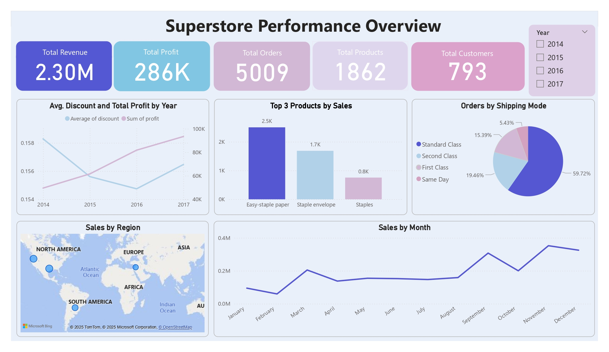

# Superstore Sales Analysis Dashboard

## Overview
This project analyzes the [Superstore Dataset](https://www.kaggle.com/datasets/vivek468/superstore-dataset-final) from Kaggle, which contains sales data for a Superstore Giant. With growing demands and cut-throat market competition, the goal was to clean, process, and visualize the data to identify optimal products, regions, categories, and customer segments to target or avoid.

## Description
Processed and cleaned the Superstore Dataset using Python and Pandas to handle missing values and data issues. Generated visualizations with Matplotlib to explore sales, profit, and customer trends. Developed a Power BI dashboard to present key business metrics, enabling actionable insights for stakeholder decision-making.

## Dashboard
Below is a picture of the Power BI dashboard visualizing sales and customer trends:



## Tools and Technologies
- Python
- Pandas
- Matplotlib
- Power BI

## Dataset
- **Source**: [Superstore Dataset](https://www.kaggle.com/datasets/vivek468/superstore-dataset-final)
- **Details**: Contains sales, profit, and customer data across various products, regions, categories, and customer segments.

## Installation
1. Clone the repository:
   ```bash
   git clone <repository-url>
   ```
2. Install required libraries:
   ```bash
   pip install -r requirements.txt
   ```

## Requirements
See `requirements.txt` for the list of Python libraries used.
